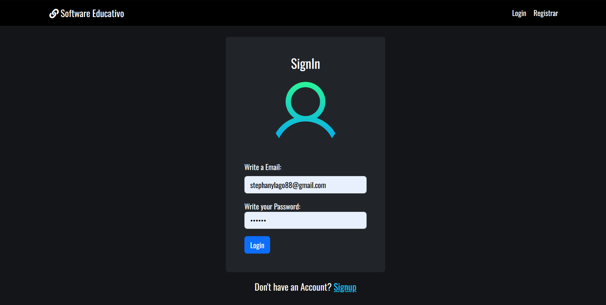

# Notes App with Nodejs and Mysql

Notes App is a Multi Page Application using Nodejs and Mysql. The purpose of this web application is just to be an example for beginners.




### Installation with Docker (Recommended)

```
git clone https://github.com/FaztTech/nodejs-mysql-links
cd nodejs-mysql-links
docker-compose up
```

Now you can visit http://localhost:3000

### Manual Installation

```
mysql -u MYUSR "-pMYPASSWORD" < ./database/db.sql # create database
npm i
npm run build
npm start
```

## File Structure

- database, it the folder with all the sql queries, you can use to recreate the database for this application
- src, it's all the code for the Backend and Frontend Application
- docs

## Environment Variables

- PORT

## Old Versions of this Project

- [version-2023](https://github.com/Moises56/proeducativo)

## Todo

1. [ ] Add docker compose production build
1. [ ] Add nodemailer for transactional emails

## Tools

- Nodejs
- Mysql
- Babel
- Docker

# Resources

- https://stackoverflow.com/questions/50093144/mysql-8-0-client-does-not-support-authentication-protocol-requested-by-server
